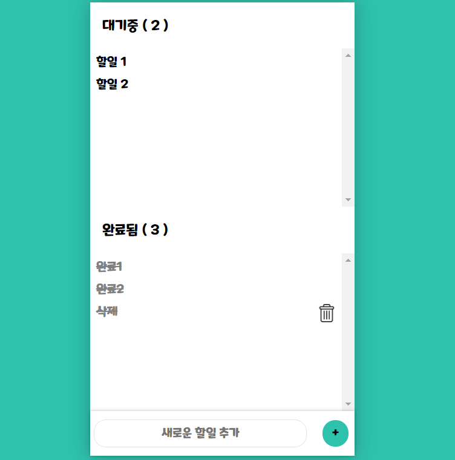

<h1 align="center">🙏Thanks_to_CEOS🙏</h1>

  

> CEOS 12th Front-End developer MoonSangJin
* CEOS에서 스터디 및 미션 수행했던 기록들입니다.

## Author

👤 **Jin**

* Github: [@MoonSangJin](https://github.com/MoonSangJin)
* Key Questions Summary : https://www.notion.so/FrontEnd-59d8608e7be04df9a501792b12c9ca32

  
# 📝CEOS Front-end 1주차 미션: Vanilla-Todo

## 미션 목표
---
- VSCode, Prettier를 이용하여 개발환경을 관리합니다.
- HTML/CSS의 기초를 이해합니다.
- JavaScript를 이용한 DOM 조작을 이해합니다.
- Vanilla.js를 이용한 어플리케이션 상태 관리 방법을 이해합니다.
---

## 결과 화면

### Key Questions
---
- DOM은 무엇인가요?
- HTML (tag) Element를 JavaScript로 생성하는 방법은 어떤 것이 있고, 어떤 방법이 가장 적합할까요?
- DOM에서 발생하는 Event는 방법에는 어떤 것이 있고, 어떤 방법이 가장 적합할까요?
- Flexbox Layout은 무엇이며, 어떻게 사용하나요?
- JavaScript가 다른 언어들에 비해 주목할만한 점에는 어떤 것들이 있나요?
- 코드의 추상화 수준이란 무엇인가요?
- 코드에서 주석을 다는 바람직한 방법은 무엇일까요?

### Key Quenstions Answer
 - https://www.notion.so/1-e6398e4499e24fe780eb124067b745e4

### 추가 작업
---
- 브라우저의 `localStorage` 이용하여 다음 번 접속 시에 기존 투두 데이터를 불러와보았다.

### 공부 및 참고한 자료
---
- [HTML/CSS 기초](https://heropy.blog/2019/04/24/html-css-starter/)
- [HTML 태그](https://heropy.blog/2019/05/26/html-elements/)
- [FlexBox 가이드](https://heropy.blog/2018/11/24/css-flexible-box/)

   
# 💌CEOS Front-end 2-3주차 미션: React-Messenger

## 미션목표

---

- React의 기초를 이해한다.
- useState로 컴포넌트의 상태를 관리할 수 있게된다.
- useEffect의 사용법을 이해한다.

---

## 결과화면

### Key Questions?

---

- Virtual DOM이 무엇일까요?
- 미션을 진행하면서 느낀, 리액트를 사용하는 장점이 있었다면?
- 리액트에서는 상태를 어떻게 관리할까요?
- styled-components 사용후기 (CSS와 비교)

### Key Question Answer

- https://www.notion.so/2-7de44d52c9f44c8ebf1ed236f9cc277f

### 구현시 고려한 요건

---

- 함수형 컴포넌트를 사용한다.
- styled-component를 이용하여 스타일링 한다.
- 상단바에 메시지를 보내는 사람의 프로필을 띄운다. + 상단바의 프로필로 메시지 발신자를 바꿀 수 있게 한다.

  (user: true는 은, user:false는 시원으로 고정됨)

- 공백메시지는 입력되지 않도록 핸들링 한다. + alert 메세지 띄우기
- 메시지 전송후 입력칸을 비워준다.
- 메시지 전송후 스크롤을 밑으로 내려준다. (Hint : useEffect + scrollBy 이용)
- 컴포넌트 이름을 역할이 잘 드러나게 짓는다.

### 공부 및 참고한 자료

---

- [create react app (CRA)](https://create-react-app.dev/docs/getting-started/)
- [리액트 docs 주요 개념 1-12](https://ko.reactjs.org/docs/hello-world.html)
- [리액트 docs Hook 1-3](https://ko.reactjs.org/docs/hooks-intro.html)
- [컴포넌트 네이밍을 위한 자바스크립트 네이밍 컨벤션](https://ui.toast.com/fe-guide/ko_CODING-CONVENSION/#%EB%AA%85%EB%AA%85-%EA%B7%9C%EC%B9%99)
- [useState, useEffect hooks](https://velog.io/@velopert/react-hooks#1-usestate)
- [styled-component](https://styled-components.com/docs/basics#getting-started)

   
# 👍CEOS Front-end 4~5주차 미션: React-Vote

## 미션목표

---

- 로그인 및 회원가입 기능을 추가.
- auth/login, /auth/signup엔드포인트를 이용해서 jwt token을 생성할 수 있습니다.
- API 문서(https://documenter.getpostman.com/view/10296679/TVep9854#72309f07-a429-4479-a8bf-3c8742004a8b)을 참고하여, 로그인/회원가입 페이지와 로그아웃 기능을 구현.
- Server의 소스코드는 https://github.com/sebastianrcnt/ceos-vote-2 에서 확인.

---

## 결과화면

### Key Questions?

---

- 웹에서 사용되는 인증 방법인 Cookie, Session, JWT 인증 방식은 각각 무엇인가요?
- JWT를 이용하여 사용자를 인증하는 원리는 무엇인가요?
- JWT Token은 어디에 저장하는 것이 가장 안전하고, 그 이유는 무엇일까요?
- CORS 정책과 CORS 문제는 무엇인가요?

### Key Question Answer

- https://www.notion.so/4-5-acbb48a1ed96482a8658d1b0be682fcf

### 공부 및 참고한 자료

---

- https://developer.mozilla.org/ko/docs/Web/HTTP/Cookies
- https://hyojin96.tistory.com/entry/Cookie와-Session
- https://velopert.com/2389
- https://dev.to/gkoniaris/how-to-securely-store-jwt-tokens-51cf
- https://gaemi606.tistory.com/145
- https://www.npmjs.com/package/react-cookie
- https://ssungkang.tistory.com/entry/React-axios-의-withCredentials

   

# So What did you make? 😉   

Give a ⭐️ if this project helped you!

***
_This README was generated with ❤️ by [readme-md-generator](https://github.com/kefranabg/readme-md-generator)_